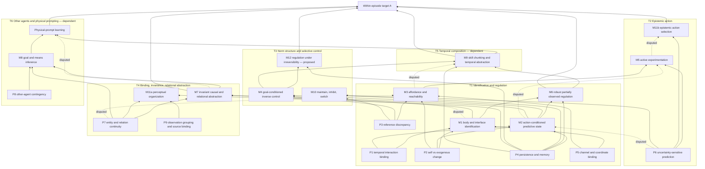

# Embodied Process

This document defines the project’s central model: what a world is, how worlds
compose, which capabilities they are intended to develop, and how evidence
changes the capability graph. It is the authority for process semantics and
capability dependencies. `CARDS.md` turns selected graph nodes into executable
contrasts; `DEVELOPMENT-PATH.md` states which contrast is built next.

## The two measurable targets

The project separates behaviour within an episode from learning across a
training lifetime. They use different evidence and must never be collapsed into
one score.

### A. Within an episode

For a declared family class `K`, select a family `F`, an instance `W`, a body
realization `B`, an outcome condition `G`, an interaction budget `N`, and a
reversibility regime. Without changing weights, the learner should:

- act above declared inaction, reactive, memorization, and public-information
  baselines;
- be reported against a privileged ceiling without receiving privileged data;
- separate identification of the instance from control of its outcome;
- use informative interventions when unresolved public ambiguity changes what
  is attainable; and
- re-solve after relevant body, dynamics, norm, or context changes.

### B. Across a training lifetime

After abstract pretraining, the same learner core should reach a fixed criterion
on a held-out abstract or grounded family with fewer interactions than:

- the identical core trained from scratch; and
- the identical core given a matched amount of alternative pretraining.

The downstream adapter, observations, actions, data order, optimizer, budget,
and evaluation are identical across arms. Earlier capability sentinels must stay
within a declared retention bound. The evidence is the learning curve and
retention record, not a terminal source-world score.

Every experiment therefore declares `K`, embodiment variation, outcome-space
invariance, reversibility, budget accounting, baseline bracket, identification
observable, and retention bound.

## World as an open process

```text
World = Body || Environment || Norm || Disturbance || OtherAgents || Scaffold
Body  = Morphology || Actuation || Sensorium
```

The learner is connected to typed observation and action ports but is not part
of the world definition. A component may contain hidden state, stochastic
transitions, continuous flow, and discrete boundary events.

| Component | Responsibility |
|---|---|
| Body | Transduce learner actions into interventions and coupled state into observations. Morphology, gains, delays, support, saturation, and cross-channel coupling belong here. |
| Environment | Supply external dynamics, persistent entities, and relations. |
| Norm | Declare an external goal, reference, cost, constraint, viability region, or composition of these. |
| Disturbance | Produce changes not caused by the learner. |
| OtherAgents | Produce independently acting demonstrators, partners, or competitors. |
| Scaffold | Temporarily reveal, calibrate, demonstrate, restrict, or support. Adding or removing it changes the contract. |

The public history at step `t` is:

```text
h[t] = (o[0], a[0], o[1], a[1], ..., o[t])
```

Public goals, costs, reveals, boundaries, and demonstration events are included
in that history. Generator state is never a learner target merely because the
simulator records it.

### Agent-centred state

Two hidden states count as equivalent for a capability test when no admissible
future learner intervention can distinguish them through the distribution of
public observations, costs, or outcomes. Finite worlds may check this exactly.
Other fragments use a declared approximation or intervention test set and
record its blind spots.

This prevents arbitrary simulator variables from becoming alleged cognitive
objects. The relevant state is the distinction that changes possible public
interaction.

## Contract and information boundary

A family is a contract-carrying process, not a simulator paired with a custom
teacher:

```text
FamilyContract = (
    process,
    parameter_domain_and_prior,
    typed_ports_and_views,
    transition_and_observation_semantics,
    goals_costs_and_constraints,
    admissible_interventions,
    preserving_and_changing_transformations,
    solver_status
)

WorldInstance = instantiate(FamilyContract, parameters, explicit_seed)
```

A semantic or prior change creates a new contract version and hash. A new seed
creates only another instance. Stored targets and audit receipts carry the
contract hash under which they were computed.

Every contract separates three views:

- **public:** family schema, declared prior, public goal, and learner-visible
  history;
- **privileged:** public data plus instantiated parameters and latent state,
  used for audits, counterfactuals, and upper bounds only; and
- **generator:** construction metadata and seeds, used for coverage, replay,
  and metamorphic checks only.

Privileged and generator values cannot influence public outputs except through
a declared reveal event. A monitor may evaluate a latent outcome and publish a
declared result, but its hidden inputs are never emitted. Boundary audits
perturb hidden values while holding public history fixed and require every
public query result to remain unchanged.

The teacher or scheduler is separate from semantic truth. It may select
examples, ordering, feedback, or explicit reveals using authorized query
results. It cannot label publicly identical histories differently because it
can see hidden state.

## Shared query algebra

One learner-independent interface answers semantic questions for every family:

```text
monitor(contract, view, trace, property)
identify(contract, view, history)
reachability(contract, view, history, property, budget)
value_bounds(contract, view, history, property, cost, budget)
strategy(contract, view, history, property, cost, budget)
agent_equivalence(contract, state_a, state_b, interventions, tolerance)
```

Auditor-only operations sit beside it:

```text
metamorphic_check(contract, transformation, traces)
noninterference_check(contract, property)
```

Queries return the object justified by available information: a verdict,
ambiguity set, probability interval, value interval, action set or distribution,
or equivalence certificate. They never invent a unique action when the public
history supports several.

Card-level quantities are derived rather than added as custom APIs:

| Quantity | Derivation |
|---|---|
| Identification observable | Diameter of `identify(public, history)`. |
| Relevant ambiguity | Public ambiguity quotiented by agent equivalence. |
| Public ceiling | Upper end of `value_bounds(public, history, ...)`. |
| Privileged ceiling | Upper end of `value_bounds(privileged, history, ...)`. |
| Ambiguity gap | Privileged ceiling minus public ceiling. |
| Epistemic value | Expected reduction in relevant ambiguity weighted by the resulting change in value bounds. |
| Matched non-informative action | Equal cost and immediate value movement, with no reduction in relevant ambiguity. |

Every backend declares one status: `Exact`, `Bounded`, `MonitorOnly`, or
`Unsupported`. The common interface is universal; exact solution is not.
Finite G0 worlds use enumeration or maintained model checking, G1 worlds use
maintained control/filtering solvers where applicable, and G2 worlds return
declared bounds and monitors. Each semantic fragment also has an independent
small-instance or certificate check so a shared simulator/query error cannot
validate itself.

## Process algebra

The current kernel is the smallest set needed to express all eight cards
without ambiguity. It is not claimed to be a complete language.

```text
P ▷ Q                          direct outputs of P into inputs of Q
P ⊗_v[rule] Q                  couple P and Q through shared variable v
interrupt_{g,resume}(P,Q)      Q displaces P at guard g; resume is explicit
restrict_{kind,K}(P)           kind is action, viability, or resource
reveal_{C,g}(P)                publish revealable C when guard g fires
```

The coupling rule for `⊗`—for example sum, override, or conflict resolution—is
part of the contract. Resource restriction also states whether the resource is
shared or local. Interrupt states explicitly whether the displaced process
resumes from its current state or restarts; this distinction is Card 07’s
central control.

Two rules are enforced by typing rather than represented as operators:

1. Ports are privileged unless explicitly declared public. Hiding is the
   default.
2. `P ◁ M` means a monitor reads `P` but has no path into `P` inputs. A verifier
   cannot become an actuator.

Norms compose separately from processes:

```text
N1 ∧ N2     both norms apply
N1 ⨟ N2     N2 supersedes N1 at a declared event
N1 ≻ N2     N1 has priority where the norms conflict
```

Delay is wiring through a standard buffer component. Channel renaming belongs
to the invariance orbit. The agent-environment feedback loop closes through the
learner ports; putting a controller inside the world would remove the behaviour
being tested. Guarded mode changes internal to one replaceable component are
component semantics, not new algebra operators.

The card coverage that fixes this kernel is:

| Construct | 01 | 02 | 03 | 04 | 05 | 06 | 07 | 08 |
|---|---:|---:|---:|---:|---:|---:|---:|---:|
| Directed wiring `▷` | yes | yes | yes | yes | yes | yes | yes | yes |
| Shared coupling `⊗` | yes |  |  |  |  | yes |  | yes |
| `interrupt` |  | yes |  | yes |  | yes | yes | yes |
| `restrict` | yes |  | yes | yes | yes |  | yes |  |
| `reveal` |  |  | yes | yes | yes |  | yes | yes |
| Norm algebra |  |  |  | yes |  |  | yes |  |

An entry means the card needs a replaceable composition seam, not merely that a
component contains similar internal behaviour.

## Capability graph

The graph is a revisable prediction about transfer: a solid arrow means that
acquiring the source is expected to reduce the interactions needed to acquire
the target. A dotted arrow is a live dispute with a declared deciding contrast.
Neither kind of edge is established by source-world success alone.



The across-lifetime target B is deliberately not a graph node. It is the
learning-curve and retention regime applied whenever any node is promoted.
Visual descendants are also not graph nodes: they are external transfer tests,
so abstract success cannot be mistaken for grounded visual competence.
Primitive nodes can support more than one trunk. Their placement in one
subgraph avoids duplicate graph identities; it does not assign exclusive
ownership. For example, reference discrepancy also supports T3, persistence
supports T3 and T4, and uncertainty-sensitive prediction supports T3.

## Trunks and their instruments

| Trunk | Development front | Distinctive evidence | Declared descendant |
|---|---|---|---|
| T1 | Identification and regulation | Identification and outcome observables separated across identifiable/unidentifiable or controllable/uncontrollable contrasts. | Adaptation after body, interface, or dynamics change. |
| T2 | Epistemic action | Informative action versus equal-cost, equal-progress non-informative action. | Active sensing or disambiguation. |
| T3 | Norm structure and selective control | Freeze state/history and change only the goal, prohibition, priority, or viability condition. | Goal-conditioned selection and safe control. |
| T4 | Binding, invariance, and relational abstraction | Behaviour constant on preserving orbits and different on surface-similar meaning-changing transformations. | Entity/relation grounding through a new sensor realization. |
| T5 | Temporal composition | Unseen ordering, interruption, completion detection, and resume-from-state against complete-sequence memorization. | Plan, compose, monitor, and recover. |
| T6 | Other agents and physical prompting | Goal emulation versus movement copying and attention following across different bodies. | Learn an outcome condition from a physical demonstration. |
| B | Continual transfer and retention | Held-out learning curves against scratch and alternative pretraining, plus earlier-family sentinels. | The project-level developmental claim. |

T1 through T4 can be isolated as primary fronts. T5 depends on reliable
closed-loop T1 procedures; otherwise a composition failure is unattributable.
T6 depends on T1 execution and T4 shared entity/relation structure; otherwise
demonstrated goals and their realization are confounded.

## Disputed dependencies

These edges remain questions, not assumptions:

| Edge | Competing explanations | Deciding contrast |
|---|---|---|
| `M1 → M4` | Goal control requires body identification, or ordinary feedback can succeed without identification. | Hold goal and budget fixed; compare benign sign/gain dynamics with delay or coupling that defeats naive feedback. |
| `P6 → M2` | Predictive state needs uncertainty, or a point prediction is sufficient. | Hold predictive means fixed and vary whether optimal action depends on variance. |
| `M2 → M5` | Information seeking requires action-conditioned prediction, or error/progress signals are sufficient. | Add a high-error region that is irrelevant to the diagnostic probe and goal. |
| `P7 → M3` | Affordance discovery needs persistent entities, or reachability is sufficient in an undifferentiated field. | Preserve reachability structure with and without individuated entities. |
| `M3 → M9` | Skill chunks depend on affordance structure, or repeated co-occurrence is sufficient. | Preserve segment exposure while flattening reachability structure. |
| `M5 → M11b` | Active experimentation produces a distinct epistemic-action competence, or both names denote one capability. | Offer a probe whose information has no later control consequence. |
| `M7 → H4` | Cross-body goal inference needs relational abstraction, or final-outcome matching is sufficient. | Compare an absolute outcome goal with one expressible only as a relation. |

`CARDS.md` assigns these contrasts to variants of Cards 01 through 08. Transfer
results keep, remove, narrow, or redirect the corresponding edge.

## Capability-to-world path

For a capability selected from the graph:

1. State a behavioural relation over public histories, actions, and outcomes.
2. Declare family class, embodiment variation, reversibility, outcome space,
   budget, and identification observable.
3. Name hypothesized parents and a downstream transfer falsifier.
4. Construct the smallest process composition in which the capability changes
   attainable behaviour.
5. Remove or invert only the crucial relation to create surgical controls.
6. Declare preserving and meaning-changing transformations.
7. Compile the family contract through the shared views and queries.
8. Audit non-interference, ambiguity, bounds, baselines, replay, and orbits.
9. Render through the common learner event boundary and run a bounded pilot.
10. Promote the family only if it produces a usable progress signal.
11. Run the matched descendant comparison when its decision gate is reached.
12. Update the graph from transfer evidence, not from source mastery.

A process operator or world family enters the apparatus only if it changes
possible public histories or attainable outcomes, isolates that change in a
matched pair, composes unambiguously, uses the shared query boundary, has a
shortcut test, predicts downstream transfer, and remains auditable within its
declared fragment.

## Grounding boundary

The core is pretrained on typed non-pixel observations. A grounded descendant
replaces the sensor realization and adds a maintained adapter while preserving
a named agent-process relation. The transfer contract fixes:

```text
GroundingTransferContract = (
    abstract_capability,
    preserved_agent_process_relation,
    downstream_family,
    allowed_adapter_and_training_data,
    predicted_learning_curve_advantage,
    scratch_and_alternative_controls,
    falsifying_outcome
)
```

The semantic audit can establish that the abstract world contains binding,
reachability, regulation, or epistemic action. It cannot establish that this
organization survives pixels, a new viewpoint, or another body. Only the
matched descendant learning curve can do that.

The current scope includes externally supplied goals, explicit viability
constraints, nonlinguistic physical demonstrations, and simulated grounded
descendants. It excludes learner-originated norms, language, claims of human
developmental order, real-robot deployment, and open-ended novelty without a
transfer contract.
